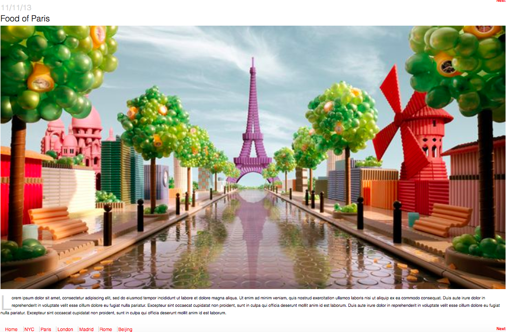

# Week-Two-Projects
These are projects I worked on when I first learned CSS and HTML. I had a lot of fun recreating the login page for FACEBOOK and a Foodist blog.

## How It's Made:

**Tech used:** HTML, CSS, JavaScript, Framework of choice
I built the wireframe from the sketch I did from before which had the layout of the different sections and parts to the articles. This made things clearer and helped structure everything I had to do using HTML.

From that basis, adding the styling to that was even easier. 

## Lessons Learned:
I learned the importance of the fundamentals and that they have a lot to do with what the user sees in the UI.
